# Getting Started Visual Studio Live! 2017 Azure Hands-on Labs

In this walkthrough, you will get connected to Microsoft Azure and Visual Studio Team Services. You will also get the code and supporting files you need onto your machine so that you may complete the walkthroughs.

You will need the following:

-   Windows 10 or Windows Server 2016 for working with the Universal Windows App

-   Visual Studio 2015 Update 3 with …

     -   Microsoft Web Development Tools.

    -   Windows 10 Tools and Windows SDKs

    -   Git for Windows

-   Azure SDK 2.9.5 for Visual Studio 2015 Update 3

> Regardless of whether you do this at a Microsoft event or on your own, you will need some online accounts described later.

The following is for future reference. **You do NOT need to do anything now.** The required accounts are as follows:

-   A least one Microsoft account (you can create them for free at <http://www.outlook.com>)

-   In addition, an additional accounts are required for working with Notification Hubs and the Xamarin Mobile Apps labs

    -   A Windows developer account

        -   <https://msdn.microsoft.com/en-us/library/windows/apps/hh868184.aspx>

-   Apple Developer Account

    -   <https://developer.apple.com/programs/>

    -   In order to work with notifications for the iOS application, you will need a physical device running iOS 9 or later.

-   Google Account

    -   <https://accounts.google.com>

In addition, you will need an Azure Subscription. Details provided later in this document. If you don’t have an Azure account, you’ll be provided with an opportunity to create one. In most cases, you will need to have an SMS capable mobile phone or access to phone that Azure can use to confirm you are in fact a human.

There are five parts in this walkthrough:

1.  Get Microsoft accounts

2.  Get a Visual Studio Dev Essentials Subscription

3.  Configure Visual Studio 2015

4.  Create and configure a directory in Azure Active Directory (AAD)

5.  Get Sample Source Code, and Load Sample Work Items into VSTS

Expected duration: 60 minutes

## Part 1: Get Microsoft accounts

In order to complete these labs, you need to have at least one Microsoft account (more information at <http://windows.microsoft.com/en-us/windows-live/sign-in-what-is-microsoft-account>). If you have an existing Microsoft account that you want to use, you can use that. 

If you have no Microsoft accounts, please visit <http://www.outlook.com> to create the necessary Microsoft account.

> Do this now if you do not have at least one Microsoft account.

If you already have a Microsoft account that you want to use, just continue.

## Part 2: Get a Visual Studio Dev Essentials Subscription

In order to do these exercises, you will need a Visual Studio Team Services account. In addition, you can get a free Visual Studio Dev Essentials subscription that provides many benefits *including free monthly credits to work with Microsoft Azure*.

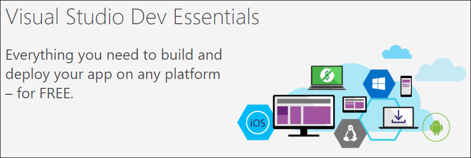

> Visual Studio Team Services accounts are free and have extended benefits if you also have an MSDN subscription. Creating or using a VSTS account during the lab will allow you to use and retrieve all of your work later.

Visual Studio Team Services is your home base for all of your development efforts. It allows you to host your code privately in the cloud, manage your work in one place, build your applications in the cloud or on premise, and gain insight into your applications. It keeps your code safe and helps you quickly get great solutions out the door. Depending upon whether or not you have an MSDN subscription or whether you have tried Visual Studio Team Services before, the getting started process you see may vary. In any case, you will need a valid Microsoft account or already linked Organizational Account to move forward.

1.  Start a web browser.

2.  Navigate to <http://www.visualstudio.com>.

3.  In the upper right-hand corner, click the **Sign In** link.

    

1.  Depending upon whether you’ve still got a browser open that has you logged into a Microsoft account, you could see a couple of different screens. Regardless follow the prompts to enter your user name and password if required.

1.  Once you’ve logged in, you may be greeted with a page like the following (*if not, jump to the next step*). It will ask you to confirm your **name**, where you’re from (country/region), and contact e-mail**.** You can change the contact to something other than your Microsoft account’s e-mail if you never check that account. Click **Continue** when ready.

    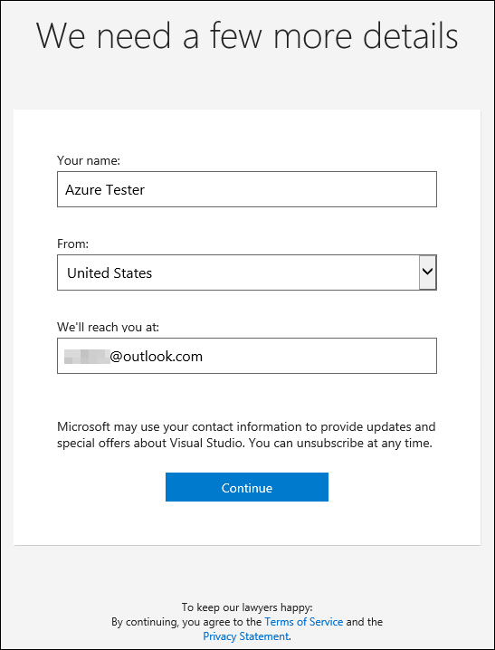

    You should now be at the **My Benefits** page. Before you go further, you need to have an Azure subscription. There are a number of ways you could already have access to an Azure subscription. You could have access to a paid account. You could also have a subscription already created as part of your MSDN benefit.

    Regardless, for now, please continue reading and following the steps.

1.  On the left-hand side of the page, find the **Use your benefits** link under **Visual Studio Dev Essentials**. Click the link.

   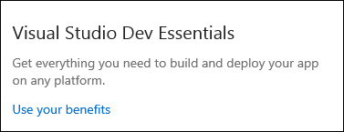

1.  Your browser will open a new tab. The exact layout and items shown might vary.

    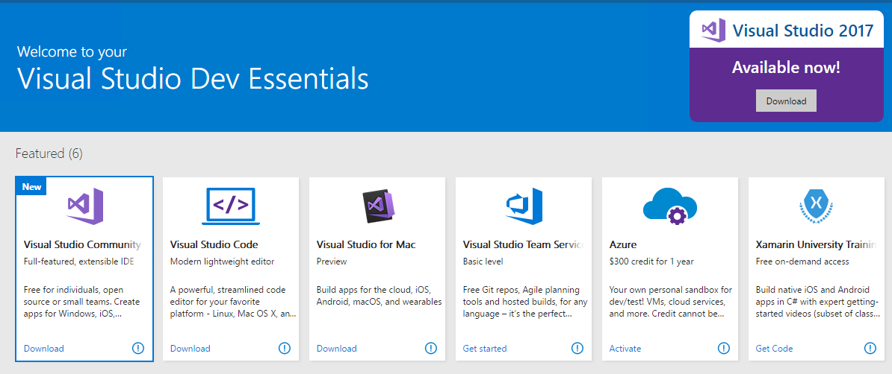

As you can see, there are a lot of great benefits (even if you have a paid MSDN subscription). If you don’t have an Azure subscription, you can get one with a year’s worth of credit.

> If you have an existing Azure subscription that you can and want to use, you can skip the next few steps and jump to **step 10** in this exercise.

Otherwise, continue reading to acquire an Azure subscription.

You’re going to activate the Azure monthly credit.

1.  Click the Activate link in the **Azure** tile (the currency should be localized to your region). Your browser will open a new tab. Your browser may open a confirmation page that requires you accept the terms by clicking **Confirm**. After you click Confirm, you’ll need to click the Activate link in the Azure tile again. In the new tab your browser opens, you’ll get a Sign up page to fill out. Do this and click **Sign up**.

    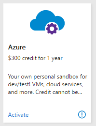

Please note, you will either need a mobile phone or be at a location where the automated verification system can call you. In addition, you will need a valid credit or debit card to complete the sign up process. Microsoft will not charge you. This is primarily a security measure. In order for Microsoft to charge you once you create your subscription, you will have to explicitly enable them to do so. By default you can only spend up to your free credit amount.

**Also Note** you can only have one “free” Azure subscription. If you have one already or you’ve used one of Microsoft’s many other free options, you’ll need to create or use a paid subscription.

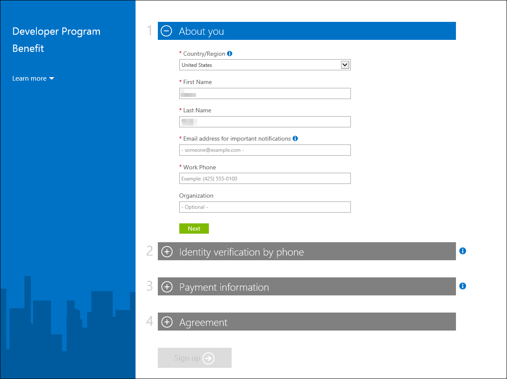

After you click **Sign Up**, you’ll see a message. Read it and wait for Azure to finish creating your subscription.

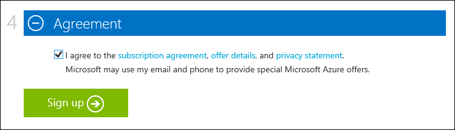

Once ready, you’ll see a message like the following (it takes as little as 30 seconds to a few minutes to complete). Wait until it’s done before continuing. It’s critical to the labs to have an Azure subscription. It’s quite possible you might get a video or a slightly different looking screen.

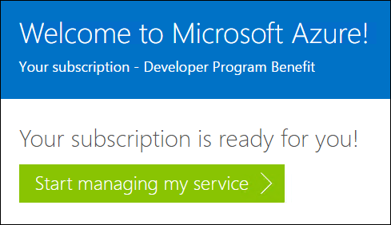

1.  Click **Start managing my service**. You will end up a screen similar to the one below.

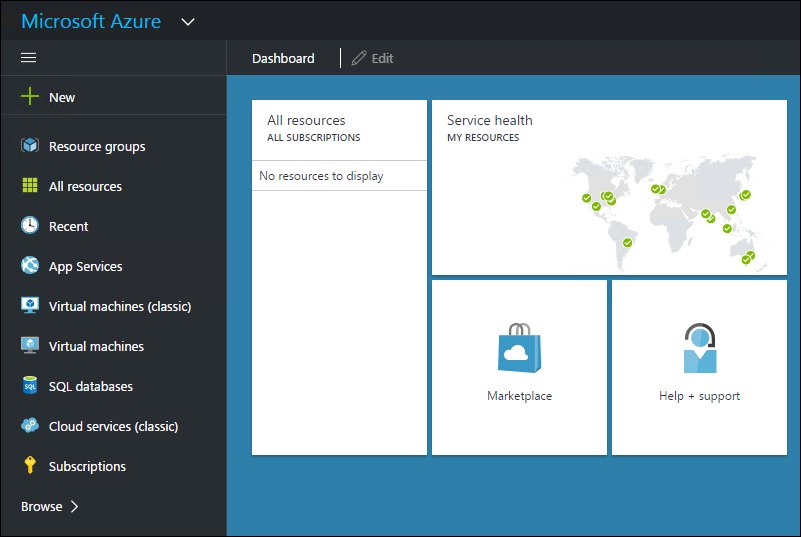

At this point, you’re ready to go.

1.  Return to the **My Information** tab in your browser.

The next section describes creating a new VSTS Account. **Please read it**. You’ll find more steps at the end of the prose.

Please continue reading before making choices. It’s important that you follow the steps carefully so your VSTS Account and Team Project get configured correctly.

When you are creating an account, there are two pieces of data Microsoft generally wants.

However, from time to time, they experiment with different ways to onboard new customers. It is possible what you see will vary. In general, the following data is required.

The first piece of data is the **Account URL**. Currently, all Visual Studio Team Services accounts live within the top-level **visualstudio.com** domain. The account name you choose could be something personal, like your name, or something more work-related, like your company name. If you do intend to set up your account to share with others at your organization, you might want to coordinate this with those in your organization that manage your servers and infrastructure. Regardless, your biggest complication might be finding a good short name. The good news is that you can change your account name later if needed.

The second field that affects your account is where Microsoft hosts your account. Visual Studio Team Services is a purpose-built cloud service hosted in Microsoft Azure. As of November 2016, Microsoft has five regions that can be used to host your account: **India South**, **Central US**, **West Europe**, **Australia East** and **Brazil South**. You should pick the one that is closest to you and the majority of users of your account. Microsoft is continuing to work to make the service available in more regions Microsoft Azure currently has 20 regions worldwide, so there are plenty of future possibilities. Once your account is created, changing your region will require a special request to Microsoft Customer Support Services.

Once you have an account, you need at least one Team Project to track you work, store your code, test, and run builds. This lab gives you specific instructions so you can use some tools and complete the lab. Understand that Visual Studio Team Services is very flexible and that you should explore it after the event.

The next section describes the Visual Studio Team Services onboarding experience. What you see can vary from the instructions presented throughout this Immersion.

1.  On your My Information screen, find the **Create new account** button and click it.

1.  On the following screen, click the **Change details** link.

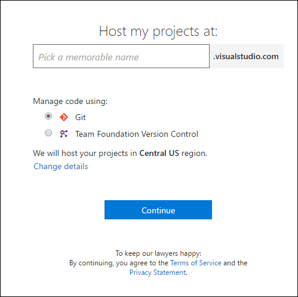

1.  Enter a value in the text field that says **Pick a memorable name** field.

It is possible you might have to try a couple different names.

1.  Select **Git** for Version Control. *This is required*.

<!-- -->

1.  Enter **azurekit** (or something that makes you happy) in the **Project name** field for your Team Project. If you use **azurekit** while you are doing this lab, your screen will better match the screenshots and instructions here.

<!-- -->

1.  Select the **Scrum** process template. *This is also required*.

<!-- -->

1.  Select the appropriate region in the drop-down box.

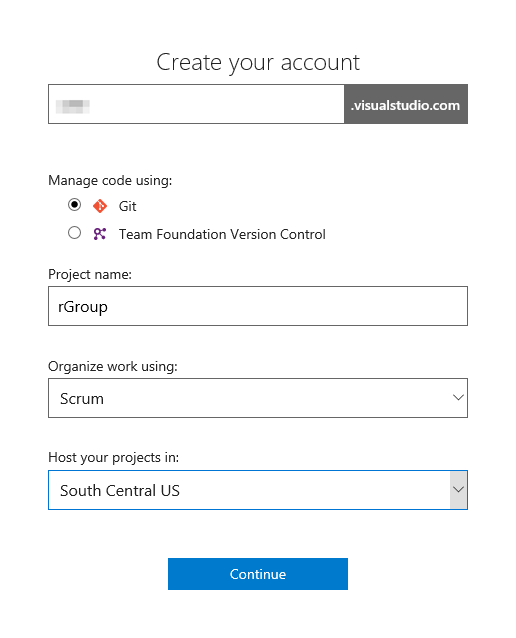

1.  Click the **Continue** button.

If you have picked an account name in use, you will receive a warning. Pick a different name and try again.

Creating a new account is fast and can take as little as a few seconds to complete.

Visual Studio Team Services queues up a job to build your Team Project and, once again, in as little as a few seconds, you will have a new Team Project.

1.  You might be greeted with a dialog offering congratulations and an offer to help you get started.

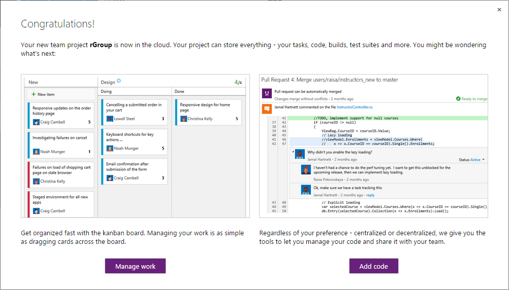

1.  If you see the above screen, click the **Add Code** button. If not, click the CODE hub link.

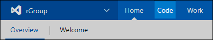

Wait for your instructor to help you get the lab exercises and code.

